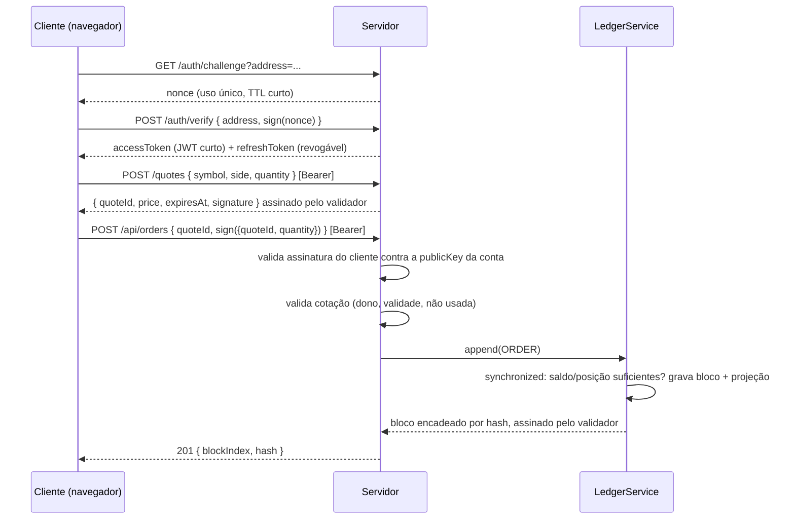

# CryptRade

[](https://github.com/iambot1193/cryptrade/actions/workflows/ci.yml)

Ledger event-sourced tamper-evident em Kotlin + Spring Boot. Conta por chave Ed25519 (sem
senha), ordem de compra/venda assinada pelo cliente, cada lançamento vira um bloco encadeado
por hash. Saldo e posição são **projeções recalculáveis do log**, não fonte de verdade — se
alguém adulterar o histórico direto no banco, `GET /ledger/verify` acusa exatamente onde.

## A demo

Sobe tudo com um comando:

```bash
cp .env.example .env
docker compose up --build
```

Abra `http://localhost:8080` — é o cliente de referência (HTML + tweetnacl-js, chave gerada e
assinada no navegador, a privada nunca sai do cliente). Gere uma chave, crie a conta, faça
login, peça uma cotação de `bitcoin` e confirme a ordem. Em menos de um minuto:

```json
GET /api/portfolio
{"cashBalance": 99500.00, "positions": [{"symbol": "bitcoin", "quantity": 0.01, ...}]}
```

Agora a parte que importa — adultere o histórico **direto no Postgres**, por fora da aplicação:

```bash
docker compose exec db psql -U cryptrade -c \
  "UPDATE ledger_blocks SET hash = repeat('0', 64) WHERE block_index = 0;"

curl -s localhost:8080/ledger/verify
# {"valid":false,"brokenAtBlock":0,"reason":"hash mismatch"}
```

Sem a adulteração, a mesma chamada devolve `{"valid":true,"brokenAtBlock":null,"reason":null}`.
Não tem coluna "adulterado" pra apagar — o hash de cada bloco cobre o anterior, então mexer em
qualquer ponto do histórico quebra a cadeia a partir dali, e `verify()` recalcula tudo do zero
pra provar.

## Por que "ledger", não "blockchain"

Estruturalmente é uma blockchain single-node: bloco, `prevHash`, encadeamento, assinatura do
validador. Mas sem consenso multi-nó a palavra "blockchain" promete uma coisa que o sistema não
entrega (descentralização) — e "blockchain caseira" é projeto de tutorial. **"Ledger
event-sourced tamper-evident"** é o mesmo código, mas é o vocabulário que um sistema financeiro
de verdade reconhece: log append-only, trilha auditável, projeção materializada, reconciliação
via replay.

## Arquitetura

### O que garante o quê

| Decisão | Por quê |
|---|---|
| Conta = par de chaves Ed25519 gerado no cliente, endereço = hash da pública | Servidor nunca vê nem guarda a privada. Login é challenge/assinatura (estilo Sign-In with Ethereum), não senha. |
| Cada ordem é assinada pelo cliente, não só o login | Sem isso o servidor poderia forjar um lançamento em nome do usuário — o ledger seria imutável mas não confiável. |
| Preço vem de cotação assinada pelo validador, cliente não define preço | Se o cliente assinasse o preço, assinaria comprar BTC a US$ 1 e o servidor aceitaria (assinatura válida, saldo suficiente). |
| `quoteId` é a chave de idempotência | Uma coisa só resolve preço, replay-protection e duplo clique/retry — sem header extra. |
| Serialização canônica (prefixo de tamanho + UTF-8), não JSON | JSON não garante bytes idênticos entre Kotlin e JS (ordem de chave, formato de decimal). Reimplementado campo a campo no cliente de referência e validado batendo os dois lados. |
| Append serializado (`synchronized` cobrindo o commit da transação) | Nó único: duas ordens concorrentes na mesma conta não podem gastar o mesmo saldo — testado com 2 threads reais, não só unit test sequencial. |
| Saldo/posição são projeção, log é fonte de verdade | `replay()` recomputa do zero decodificando o log e bate com a tabela materializada — se divergisse, seria sinal de adulteração ou bug. |
| Postgres + Flyway, H2 só no perfil de teste | Ledger imutável que evapora no restart não é ledger. Testado com Testcontainers contra Postgres real, não só H2. |

### Fluxo de uma ordem



### Por que o `synchronized` sozinho não bastava

`LedgerService.append()` já serializa e comita dentro do mesmo `synchronized` — de propósito,
com `TransactionTemplate` explícito em vez de `@Transactional` (o proxy do Spring só comitaria
*depois* de sair do bloco). O bug real apareceu quando `OrderService.placeOrder` também tinha
`@Transactional`: como a transação de `append()` só *entra* na transação já aberta em vez de
abrir a própria, o lock liberava antes do commit de verdade acontecer. Duas ordens concorrentes
liam o mesmo saldo desatualizado e as duas passavam. O teste de concorrência
(`OrderServiceTest`) pegou isso; a correção foi tirar o `@Transactional` de `placeOrder` e mover
a checagem de saldo/posição pra dentro do `applyProjection`, que roda sob o lock — o único lugar
onde ler, decidir e gravar é atômico de verdade.

## Endpoints

| Método | Rota | Auth | Descrição |
|---|---|---|---|
| `POST` | `/accounts` | — | `{ publicKey, signature }` → endereço = hash da pública; cria conta + saldo inicial |
| `GET` | `/auth/challenge?address=` | — | Nonce de login, uso único |
| `POST` | `/auth/verify` | — | `{ address, signature }` → access token + refresh token |
| `POST` | `/auth/refresh` | — | `{ refreshToken }` → novo access token |
| `POST` | `/auth/logout` | — | Revoga o refresh token |
| `POST` | `/quotes` | Bearer | `{ symbol, side, quantity }` → cotação assinada, válida por 30s |
| `POST` | `/api/orders` | Bearer | `{ quoteId, signature }` → executa a ordem, retorna o bloco |
| `GET` | `/api/portfolio` | Bearer | Saldo, posições e equity da conta autenticada |
| `GET` | `/api/prices/{symbol}` | — | Preço atual (`bitcoin`, `ethereum`, `solana`) |
| `GET` | `/ledger/verify` | — | Recalcula o encadeamento de hash e confere assinaturas |
| `GET` | `/admin/audit` | Bearer (ADMIN) | Login falho, assinatura rejeitada, cotação expirada |

## Stack

- Kotlin + Spring Boot 4 (Web MVC, Data JPA, Validation)
- Postgres + Flyway (H2 em memória só no perfil de teste)
- Ed25519 nativo do JDK (`java.security.Signature`, sem Bouncy Castle) + tweetnacl-js no cliente
- Gradle (Kotlin DSL)
- Preço de mercado: [CoinGecko API](https://www.coingecko.com/en/api) (pública, sem chave)

### Perfis

| Perfil | Fonte de preço |
|---|---|
| padrão | `CoinGeckoPriceProvider` — preço real de mercado |
| `test`, `demo` | `FakePriceProvider` — preço determinístico, sem rede |

`demo` existe pra CI e demonstração não dependerem de rede nem do rate limit da CoinGecko.

### Variáveis de ambiente

Ver `.env.example`. As chaves do validador (`CRYPTRADE_VALIDATOR_PRIVATE_KEY`/`PUBLIC_KEY`) e o
segredo do JWT (`CRYPTRADE_JWT_SECRET`) têm um valor fixo de demo ali — sem eles, o processo
gera um par efêmero a cada boot e um restart faz blocos legítimos parecerem adulterados
(a identidade de quem assinou muda). `CRYPTRADE_ADMIN_ADDRESS` fica vazio por padrão: preencha
com o endereço de uma conta já criada pra promovê-la a `ADMIN` no próximo boot.

## Build e testes

```bash
./gradlew build
```

Os testes unitários/de integração leve rodam no perfil `test` (H2, preço determinístico, sem
rede). Um teste à parte (`FlywayPostgresIntegrationTest`) sobe um Postgres real via
Testcontainers e prova que `ddl-auto=validate` aceita exatamente o schema que o Flyway migrou —
precisa de Docker rodando.

Os cinco testes que sustentam o pitch (em `ledger/`):

| Teste | O que prova |
|---|---|
| `LedgerServiceTest.tampering a committed block is detected by verify()` | Adulterar um bloco no meio do log é detectado |
| `AccountServiceTest.create account with a forged signature is rejected` | Assinatura forjada não cria conta |
| `OrderServiceTest.forged order signature is rejected` | Assinatura forjada não executa ordem |
| `LedgerServiceTest.replay from zero matches the live projection` | Saldo/posição recalculados do log batem com a projeção |
| `OrderServiceTest.concurrent orders on the same account do not double-spend` | Duas ordens simultâneas na mesma conta não gastam o mesmo saldo |
| `OrderServiceTest.same quoteId submitted twice executes only once` | Idempotência: retry do mesmo `quoteId` não duplica a execução |
| `LedgerHttpFlowTest` | Fluxo HTTP completo: criar conta → login → cotação → ordem assinada |

## Estrutura do projeto

```
src/main/kotlin/com/felipelopes/cryptrade/
├── CryptradeApplication.kt
├── config/
│   └── RestClientConfig.kt          # bean do RestClient para a CoinGecko
├── controller/
│   └── PriceController.kt           # GET /api/prices/{symbol}
├── domain/
│   └── OrderSide.kt                 # enum BUY/SELL, compartilhado
├── service/
│   ├── PriceService.kt / PriceProvider.kt
│   ├── CoinGeckoPriceProvider.kt    # perfil padrão
│   └── FakePriceProvider.kt         # perfis test e demo
├── dto/                             # request/response, isolam a entidade da API
├── exception/
│   ├── TradingExceptions.kt         # InsufficientFunds, InsufficientPosition, UnknownSymbol
│   └── GlobalExceptionHandler.kt    # @RestControllerAdvice -> HTTP status
└── ledger/                          # o nucleo: contas, autenticacao, cotacao, ordem assinada
    ├── Account.kt / Position.kt / Quote.kt / RefreshToken.kt / AuditLog.kt   # entidades JPA
    ├── LedgerBlock.kt / LedgerEntry.kt                                       # o log em si
    ├── CanonicalSerializer.kt        # serializacao/hash deterministicos
    ├── SignatureVerifier.kt          # Ed25519 nativo + interop com chave crua (tweetnacl-js)
    ├── ValidatorKeyProvider.kt       # chave do validador, configuravel ou efemera
    ├── LedgerService.kt              # append serializado, verify(), replay()
    ├── AccountService.kt / AuthService.kt / QuoteService.kt / OrderService.kt
    ├── JwtService.kt / ChallengeStore.kt / RateLimiter.kt
    ├── AdminSeeder.kt                # promove cryptrade.admin.address a ADMIN no boot
    └── *Controller.kt                # camada HTTP

src/main/resources/
├── db/migration/                    # V1 esqueleto -> V2 ledger -> V3 contas/ordens/cleanup
└── static/index.html                # cliente de referencia (tweetnacl-js)
```

## Fora de escopo (YAGNI)

PoW/consenso multi-nó, secp256k1/carteiras Ethereum reais, custódia de chave privada no
servidor, máquina de estados de ordem (a execução é síncrona, sem mempool), Prometheus/Grafana.
Ver `plan.md` (local, não versionado) pra decisões completas e o roadmap de bônus.

## Licença

[MIT](LICENSE).
